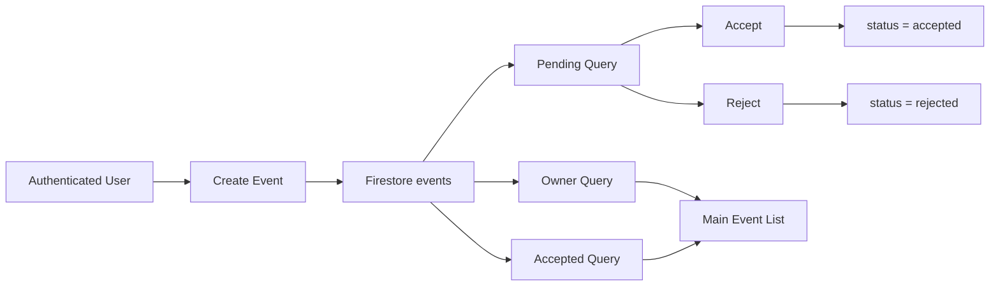

<div align="center">

# 🎉 EventBuddyApp

An iOS event-planning application built with **SwiftUI** and **Firebase**, focused on creating events, inviting participants by email, and managing invitation states in real time.


</div>

---

## 🎯 Overview

EventBuddyApp provides an event and invitation workflow for authenticated users.

Users can:

- authenticate,
- create events,
- add date, location, and description information,
- invite users by email,
- see owned and accepted events,
- review pending invitations,
- accept or reject invitations,
- delete events they own,
- receive live Firestore-backed list updates.

---

## ✨ Features

### 🔐 Authentication

- Firebase Authentication session handling
- Auth-state observation
- Login and sign-up flows
- Sign-out support

### 📅 Event Management

- Create a new event
- Event title
- Date selection
- Location
- Description
- Invitee emails
- Owner-aware delete behavior

### ✉️ Invitation Workflow

Participant states are represented as event membership statuses:

| Status | Meaning |
|---|---|
| `owner` | Event creator |
| `pending` | Invitation waiting for a response |
| `accepted` | Invitation accepted |
| `rejected` | Invitation rejected |

The app keeps owned, accepted, and pending event queries separate and updates them through Firestore snapshot listeners.

---

## 🏗️ Architecture

The project uses a SwiftUI-first structure with observable view models and Firebase services.

```text
EventBuddyApp/
├── EventBuddyApp.swift
├── MainView.swift
├── MainViewModel.swift
├── AuthenticationView.swift
├── LoginViewController.swift
├── LoginViewRepresentable.swift
├── SignUpViewController.swift
├── SignUpViewRepresentable.swift
├── AddEventView.swift
├── EventListViewModel.swift
├── EventRowView.swift
├── PendingEventRow.swift
├── Event.swift
└── GoogleService-Info.plist
```

### UI integration

The repository combines:

- SwiftUI application screens
- UIKit authentication controllers
- SwiftUI representable wrappers for bridging UIKit flows

---

## 🔄 Event Data Flow



---

## 🔥 Firebase Data Model

The current implementation stores event documents in an `events` collection.

A simplified conceptual document:

```text
events/{eventId}
├── title
├── date
├── description
├── location
├── ownerId
└── participants
    ├── userA: owner
    ├── userB: pending
    └── userC: accepted
```

Invitee emails are resolved against user records before participant statuses are added.

---

## 🚀 Getting Started

### Prerequisites

- macOS
- Xcode
- An iOS simulator or physical device
- A Firebase project

### 1. Clone the repository

```bash
git clone https://github.com/halilkrm/EventBuddyApp.git
cd EventBuddyApp
```

### 2. Open the Xcode project

Open the `.xcodeproj` file in Xcode.

### 3. Configure Firebase

Create your own Firebase project and configure at least the services used by the app:

- Firebase Authentication
- Cloud Firestore

Download your project's `GoogleService-Info.plist` and add/replace it in the Xcode target.

> Use your own Firebase project configuration when running a fork or local copy.

### 4. Configure Firestore data and rules

The application expects event data and user lookup data compatible with the current source-code queries. Review the Firestore collection names and security rules before production use.

### 5. Run

Select a simulator/device and press **Run** in Xcode.

---

## ⚠️ Notes

- This repository is an application project, not a production-ready event platform.
- Firestore security rules are critical for enforcing ownership and invitation permissions server-side.
- Firebase configuration should be reviewed before publishing a production build.
- The current source includes real-time listeners; listener lifecycle and query/index requirements should be considered as the dataset grows.

---
